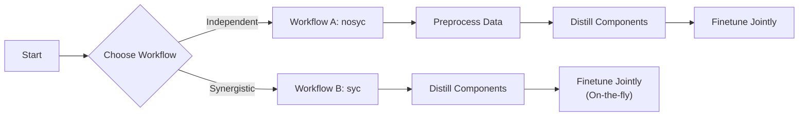
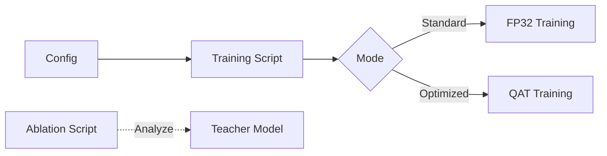

# Dual-Path Compression for Real-Time Multimodal Clickbait Detection
### Quantization and Distillation


This project explores two primary techniques for optimizing a multi-modal classification model: **Knowledge Distillation** and **Quantization-Aware Training (QAT)**.

---

## 🛠️ Prerequisites

Before you begin, ensure your environment meets the following requirements:

| Component | Recommendation |
| :--- | :--- |
| **Python** | Version **3.10** |
| **GPU** | NVIDIA GPU (Highly recommended for training) |
| **OS** | Linux / macOS / Windows |

---

## 🚀 Setup & Installation

#### 1. Create and Activate Virtual Environment

<details>
<summary>Click to expand setup instructions for your OS</summary>

**Linux / macOS**
```bash
python3 -m venv .venv
source .venv/bin/activate

```

**Windows (PowerShell)**

```bash
python -m venv .venv
.venv\Scripts\Activate.ps1

```

</details>

#### 2. Install Core Dependencies

* **PyTorch**: Visit [pytorch.org](https://pytorch.org/get-started/locally/) for your specific CUDA version.
* **PyG**: Follow the [PyTorch Geometric guide](https://pytorch-geometric.readthedocs.io/en/latest/install/installation.html).

#### 3. Install Project Requirements

```bash
pip install -r requirements.txt

```

---

## 📥 Model Zoo & Preparation

This project relies on several pre-trained foundation models. Please download them into the `model/` directory.

```bash
mkdir model && cd model
git lfs install

```

| Model Type | Repository URL | Local Command |
| --- | --- | --- |
| **Text Encoder** | [hfl/chinese-roberta-wwm-ext](https://huggingface.co/hfl/chinese-roberta-wwm-ext) | `git clone https://huggingface.co/hfl/chinese-roberta-wwm-ext` |
| **Vision Encoder** | [openai/clip-vit-base-patch32](https://huggingface.co/openai/clip-vit-base-patch32) | `git clone https://huggingface.co/openai/clip-vit-base-patch32` |
| **LTP Model** | [LTP/small](https://huggingface.co/LTP/small) | `cd .. && git clone https://huggingface.co/LTP/small LTP/small` |

> **Note:** External download links for trained distilled/quantized models are currently unavailable. Please follow the **Training Routes** below to generate them locally.

---

## ⚡ Technical Routes

Choose one of the two technical routes below to run the project.

### Route 1: Model Distillation

Train smaller "student" models to mimic larger "teacher" models.



#### Workflow A: Independent Distillation (`nosyc`)

*Pre-processes graph data before training.*

1. **Preprocess Graph Data**:
```bash
python preprocess.py

```


2. **Distill Models**:
```bash
python distill_nosyc.py

```


3. **Finetune Final Model**:
```bash
python finetune_nosyc_distilled_model.py

```


* **Output**: `./final_lightweight_model.pth`


#### Workflow B: Synergistic Distillation (`syc`)

*Processes graphs on-the-fly during training.*

1. **Distill Models**:
```bash
python distill_syc.py

```


2. **Finetune Final Model**:
> ⚠️ **Important:** The output directory of `distill_syc.py` (`syc_new_lightweight_models`) may not match the input expected by the finetuner. Please rename the folder or update the path in the script before running.


```bash
python finetune_syc_distilled_model.py

```


* **Output**: `./final_distilled_multimodal_model.pth`


---

### Route 2: Model Quantization

Use Quantization-Aware Training (QAT) to reduce precision (FP32 → INT8).



#### Run Training

Control FP32 or QAT mode via your configuration file (e.g., `./config/config.txt`).

```bash
python main_benchmark_trainer_FP32_or_QAT_with_ablation.py

```

#### Run Ablation Study

Analyze the impact of different teacher model components.

```bash
python ablation_study_teacher_model.py

```

---

## 📂 Directory Structure Note

To keep the repository lightweight, the following directories are ignored by git:

* `model_distilled/` - Distilled lightweight models.
* `model_quantized_native/` - Quantized models.
* `model/` - Large foundation models.


